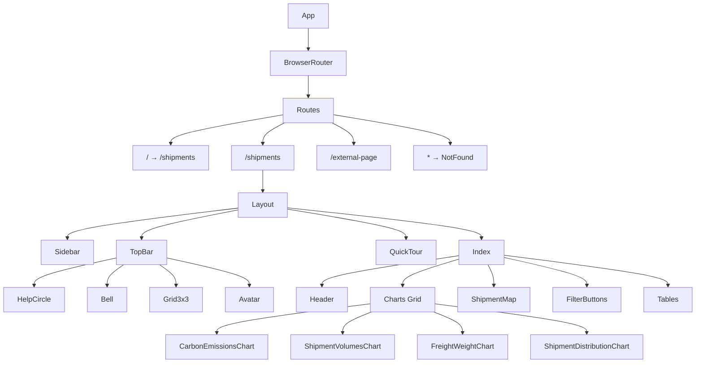
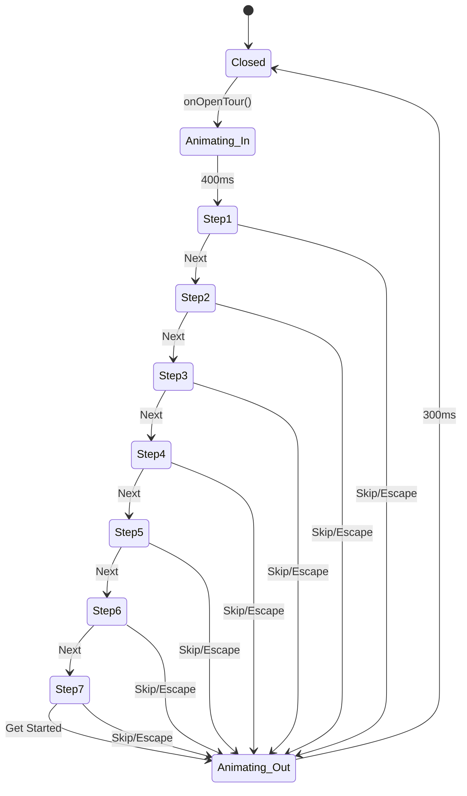

# Pro Carrier Demo - UML Documentation

## Table of Contents
1. [System Architecture](#1-system-architecture)
2. [Component Hierarchy](#2-component-hierarchy)
3. [Data Flow Diagrams](#3-data-flow-diagrams)
4. [Sequence Diagrams](#4-sequence-diagrams)
5. [State Diagrams](#5-state-diagrams)
6. [Class Diagrams](#6-class-diagrams)
7. [Use Case Diagrams](#7-use-case-diagrams)

---

## 1. System Architecture

### High-Level Architecture Diagram

```
┌─────────────────────────────────────────────────────────────────────────────┐
│                              CLIENT BROWSER                                  │
├─────────────────────────────────────────────────────────────────────────────┤
│                                                                             │
│  ┌─────────────────────────────────────────────────────────────────────┐   │
│  │                         REACT APPLICATION                            │   │
│  │                         (Vite + TypeScript)                          │   │
│  ├─────────────────────────────────────────────────────────────────────┤   │
│  │                                                                       │   │
│  │  ┌─────────────┐  ┌─────────────┐  ┌─────────────┐  ┌─────────────┐ │   │
│  │  │   Router    │  │    State    │  │     UI      │  │   Utils     │ │   │
│  │  │ (React      │  │  Management │  │ Components  │  │  & Helpers  │ │   │
│  │  │  Router)    │  │  (useState) │  │ (shadcn/ui) │  │             │ │   │
│  │  └─────────────┘  └─────────────┘  └─────────────┘  └─────────────┘ │   │
│  │                                                                       │   │
│  │  ┌─────────────────────────────────────────────────────────────────┐ │   │
│  │  │                     FEATURE MODULES                              │ │   │
│  │  ├─────────────┬─────────────┬─────────────┬─────────────┬─────────┤ │   │
│  │  │  Dashboard  │   Charts    │     Map     │   Tables    │  Tour   │ │   │
│  │  │   Layout    │  (Recharts) │  (Mapbox)   │  (AG-Grid)  │ (Custom)│ │   │
│  │  └─────────────┴─────────────┴─────────────┴─────────────┴─────────┘ │   │
│  │                                                                       │   │
│  └─────────────────────────────────────────────────────────────────────┘   │
│                                                                             │
├─────────────────────────────────────────────────────────────────────────────┤
│                            STYLING LAYER                                    │
│  ┌─────────────┐  ┌─────────────┐  ┌─────────────┐                         │
│  │ Tailwind CSS│  │  CSS Vars   │  │  Custom     │                         │
│  │             │  │ (Design     │  │  Styles     │                         │
│  │             │  │  Tokens)    │  │             │                         │
│  └─────────────┘  └─────────────┘  └─────────────┘                         │
└─────────────────────────────────────────────────────────────────────────────┘

┌─────────────────────────────────────────────────────────────────────────────┐
│                           EXTERNAL SERVICES                                  │
├─────────────────────────────────────────────────────────────────────────────┤
│  ┌─────────────┐  ┌─────────────┐  ┌─────────────┐                         │
│  │  Mapbox GL  │  │  Static     │  │   Future    │                         │
│  │    API      │  │   Data      │  │   REST API  │                         │
│  │  (Maps)     │  │  (Mock)     │  │  (Backend)  │                         │
│  └─────────────┘  └─────────────┘  └─────────────┘                         │
└─────────────────────────────────────────────────────────────────────────────┘
```

---

## 2. Component Hierarchy

### Application Component Tree

```
App
├── BrowserRouter
│   └── Routes
│       ├── Route "/" → Navigate to "/shipments"
│       ├── Route "/shipments"
│       │   └── Layout
│       │       ├── Sidebar
│       │       │   └── Navigation Links
│       │       ├── TopBar
│       │       │   ├── HelpCircle (Tour Trigger)
│       │       │   ├── Bell (Notifications)
│       │       │   ├── Grid3x3 (Layout Toggle)
│       │       │   └── Avatar (Profile)
│       │       ├── QuickTour (Conditional)
│       │       │   ├── Backdrop
│       │       │   ├── Highlight Overlay
│       │       │   └── Tooltip Card
│       │       │       ├── Illustration
│       │       │       ├── Progress Bar
│       │       │       ├── Title & Description
│       │       │       ├── Step Indicators
│       │       │       └── Navigation Buttons
│       │       └── Main Content
│       │           └── Index (Shipments Page)
│       │               ├── Header
│       │               ├── Charts Grid
│       │               │   ├── DashboardCard (Carbon Emissions)
│       │               │   │   └── CarbonEmissionsChart
│       │               │   ├── DashboardCard (Shipment Volumes)
│       │               │   │   └── ShipmentVolumesChart
│       │               │   ├── DashboardCard (Freight Spend)
│       │               │   │   └── FreightWeightChart
│       │               │   └── DashboardCard (Mode Distribution)
│       │               │       └── ShipmentDistributionChart
│       │               ├── DashboardCard (Live Tracking)
│       │               │   └── ShipmentMap
│       │               ├── FilterButtons
│       │               └── Shipment Tables
│       │                   ├── Collapsible (In-Transit)
│       │                   │   └── ShipmentTable
│       │                   ├── Collapsible (Pending)
│       │                   │   └── ShipmentTable
│       │                   └── Collapsible (Completed)
│       │                       └── ShipmentTable
│       ├── Route "/external-page"
│       │   └── ExternalPage
│       └── Route "*"
│           └── NotFound
└── Toaster (Notifications)
```

---

## 3. Data Flow Diagrams

### Cross-Filter Data Flow

```
┌─────────────────────────────────────────────────────────────────────┐
│                         INDEX COMPONENT                              │
│                                                                      │
│  ┌──────────────────────────────────────────────────────────────┐   │
│  │           State: crossFilterMode (null | "Sea" | "Air" | "Road") │
│  └──────────────────────────────────────────────────────────────┘   │
│                              │                                       │
│                              ▼                                       │
│  ┌──────────────────────────────────────────────────────────────┐   │
│  │              handleCrossFilterChange(mode)                    │   │
│  │     Sets crossFilterMode to mode (or null if same mode)       │   │
│  └──────────────────────────────────────────────────────────────┘   │
│                              │                                       │
│         ┌────────────────────┼────────────────────┐                 │
│         ▼                    ▼                    ▼                 │
│  ┌─────────────┐      ┌─────────────┐      ┌─────────────┐         │
│  │   Carbon    │      │  Shipment   │      │   Freight   │         │
│  │  Emissions  │      │   Volumes   │      │   Spend     │         │
│  │   Chart     │      │    Chart    │      │    Chart    │         │
│  └─────────────┘      └─────────────┘      └─────────────┘         │
│         │                    │                    │                 │
│         └────────────────────┼────────────────────┘                 │
│                              ▼                                       │
│                    ┌─────────────────┐                              │
│                    │  Filtered Data  │                              │
│                    │    Display      │                              │
│                    └─────────────────┘                              │
└─────────────────────────────────────────────────────────────────────┘
```

### Quick Tour Data Flow

```
┌─────────────────────────────────────────────────────────────────────┐
│                        LAYOUT COMPONENT                              │
│                                                                      │
│  State: isTourOpen (boolean)                                        │
│         isLayoutExpanded (boolean)                                  │
│                                                                      │
│  ┌─────────────────────────────────────────────────────────────┐    │
│  │                         TopBar                               │    │
│  │  Props: onOpenTour={() => setIsTourOpen(true)}              │    │
│  └─────────────────────────────────────────────────────────────┘    │
│                              │                                       │
│                              │ User clicks help icon                 │
│                              ▼                                       │
│  ┌─────────────────────────────────────────────────────────────┐    │
│  │                       QuickTour                              │    │
│  │  Props: isOpen={isTourOpen}                                  │    │
│  │         onClose={() => setIsTourOpen(false)}                │    │
│  │                                                              │    │
│  │  Internal State:                                             │    │
│  │  - currentStepIndex (0-6)                                    │    │
│  │  - anchorRect (position of highlighted element)              │    │
│  │  - isAnimating (transition state)                            │    │
│  │  - isVisible (fade in/out)                                   │    │
│  └─────────────────────────────────────────────────────────────┘    │
│                              │                                       │
│                              ▼                                       │
│  ┌─────────────────────────────────────────────────────────────┐    │
│  │              DOM Query: data-tour-id                         │    │
│  │                                                              │    │
│  │  tour-topbar → TopBar container                              │    │
│  │  tour-notifications → Bell icon                              │    │
│  │  tour-layout-toggle → Grid icon                              │    │
│  │  tour-profile → Avatar                                       │    │
│  │  tour-charts-grid → Charts 2x2 grid                          │    │
│  │  tour-map → Map container                                    │    │
│  │  tour-tables → Tables section                                │    │
│  └─────────────────────────────────────────────────────────────┘    │
└─────────────────────────────────────────────────────────────────────┘
```

---

## 4. Sequence Diagrams

### Quick Tour Interaction Sequence

```
┌──────┐          ┌──────────┐          ┌───────────┐          ┌─────┐
│ User │          │  TopBar  │          │  Layout   │          │Tour │
└──┬───┘          └────┬─────┘          └─────┬─────┘          └──┬──┘
   │                   │                      │                   │
   │  Click ? icon     │                      │                   │
   │──────────────────>│                      │                   │
   │                   │                      │                   │
   │                   │  onOpenTour()        │                   │
   │                   │─────────────────────>│                   │
   │                   │                      │                   │
   │                   │                      │ setIsTourOpen(true)
   │                   │                      │──────────────────>│
   │                   │                      │                   │
   │                   │                      │                   │ Initialize
   │                   │                      │                   │ currentStep=0
   │                   │                      │                   │
   │                   │                      │       Query DOM   │
   │                   │                      │<──────────────────│
   │                   │                      │  [data-tour-id]   │
   │                   │                      │                   │
   │                   │                      │ getBoundingRect() │
   │                   │                      │──────────────────>│
   │                   │                      │                   │
   │<─────────────────────────────────────────────────────────────│
   │                   Render Tour Overlay                        │
   │                   │                      │                   │
   │  Click "Next"     │                      │                   │
   │─────────────────────────────────────────────────────────────>│
   │                   │                      │                   │
   │                   │                      │                   │ currentStep++
   │                   │                      │                   │ scrollIntoView
   │                   │                      │                   │ updateAnchor
   │                   │                      │                   │
   │<─────────────────────────────────────────────────────────────│
   │                   Move highlight to next element             │
   │                   │                      │                   │
   │  Click "Get Started" (last step)        │                   │
   │─────────────────────────────────────────────────────────────>│
   │                   │                      │                   │
   │                   │                      │  onClose()        │
   │                   │                      │<──────────────────│
   │                   │                      │                   │
   │                   │                      │ setIsTourOpen(false)
   │                   │                      │                   │
   │<─────────────────────────────────────────────────────────────│
   │                   Tour closes                                │
└──┴───┘          └────┴─────┘          └─────┴─────┘          └──┴──┘
```

### Chart Cross-Filter Sequence

```
┌──────┐       ┌────────────┐       ┌───────┐       ┌─────────────┐
│ User │       │   Chart    │       │ Index │       │ Other Charts│
└──┬───┘       └─────┬──────┘       └───┬───┘       └──────┬──────┘
   │                 │                  │                  │
   │  Click on       │                  │                  │
   │  "Sea" bar      │                  │                  │
   │────────────────>│                  │                  │
   │                 │                  │                  │
   │                 │ onCrossFilterChange("Sea")          │
   │                 │─────────────────>│                  │
   │                 │                  │                  │
   │                 │                  │ setCrossFilterMode("Sea")
   │                 │                  │                  │
   │                 │                  │  Re-render with  │
   │                 │                  │  crossFilterMode │
   │                 │                  │─────────────────>│
   │                 │                  │                  │
   │                 │<─────────────────│                  │
   │                 │ Highlight "Sea"  │                  │
   │                 │                  │                  │
   │<────────────────────────────────────────────────────────
   │          All charts filter to show only "Sea" data   │
   │                 │                  │                  │
   │  Click "Sea"    │                  │                  │
   │  again          │                  │                  │
   │────────────────>│                  │                  │
   │                 │                  │                  │
   │                 │ onCrossFilterChange("Sea")          │
   │                 │─────────────────>│                  │
   │                 │                  │                  │
   │                 │                  │ Same mode clicked
   │                 │                  │ setCrossFilterMode(null)
   │                 │                  │                  │
   │<────────────────────────────────────────────────────────
   │          Filter cleared, all data shown              │
└──┴───┘       └─────┴──────┘       └───┴───┘       └──────┴──────┘
```

---

## 5. State Diagrams

### Quick Tour State Machine

```
                                    ┌─────────────┐
                                    │             │
                                    │   CLOSED    │
                                    │             │
                                    └──────┬──────┘
                                           │
                                           │ onOpenTour()
                                           ▼
                                    ┌─────────────┐
                                    │             │
                           ┌───────>│  ANIMATING  │<───────┐
                           │        │   (fade in) │        │
                           │        └──────┬──────┘        │
                           │               │               │
                           │               │ 400ms         │
                           │               ▼               │
                           │        ┌─────────────┐        │
                           │        │             │        │
                           │        │   STEP 1    │        │
                           │        │  (TopBar)   │        │
                           │        └──────┬──────┘        │
                           │               │               │
                           │               │ Next          │
                           │               ▼               │
                           │        ┌─────────────┐        │
                           │        │             │        │
                           │        │   STEP 2    │        │
                           │        │(Notifications)       │
                           │        └──────┬──────┘        │
                           │               │               │
                           │               │ Next          │
                           │               ▼               │
                           │        ┌─────────────┐        │
                           │        │             │        │
                           │        │   STEP 3    │        │
                           │        │(Layout Toggle)       │
                           │        └──────┬──────┘        │
                           │               │               │
     onClose() / Escape    │               │ Next          │
     Skip / Click backdrop │               ▼               │
                           │        ┌─────────────┐        │
                           │        │             │        │
                           │        │   STEP 4    │        │
                           │        │  (Profile)  │        │
                           │        └──────┬──────┘        │
                           │               │               │
                           │               │ Next          │
                           │               ▼               │
                           │        ┌─────────────┐        │
                           │        │             │        │
                           │        │   STEP 5    │        │
                           │        │  (Charts)   │        │
                           │        └──────┬──────┘        │
                           │               │               │
                           │               │ Next          │
                           │               ▼               │
                           │        ┌─────────────┐        │
                           │        │             │        │
                           │        │   STEP 6    │        │
                           │        │   (Map)     │────────┘
                           │        └──────┬──────┘  scrollIntoView
                           │               │         if needed
                           │               │ Next
                           │               ▼
                           │        ┌─────────────┐
                           │        │             │
                           │        │   STEP 7    │────────┐
                           │        │  (Tables)   │        │ scrollIntoView
                           │        └──────┬──────┘        │ if needed
                           │               │               │
                           │               │ "Get Started" │
                           │               ▼               │
                           │        ┌─────────────┐        │
                           │        │             │        │
                           └────────│  ANIMATING  │<───────┘
                                    │  (fade out) │
                                    └──────┬──────┘
                                           │
                                           │ 300ms
                                           ▼
                                    ┌─────────────┐
                                    │             │
                                    │   CLOSED    │
                                    │             │
                                    └─────────────┘
```

### Layout Toggle State Machine

```
                    ┌─────────────────────────────────┐
                    │                                 │
                    │        COMPACT VIEW             │
                    │   (isLayoutExpanded = false)    │
                    │                                 │
                    │   ┌─────────┬─────────┐        │
                    │   │ Chart 1 │ Chart 2 │  Map   │
                    │   ├─────────┼─────────┤        │
                    │   │ Chart 3 │ Chart 4 │        │
                    │   └─────────┴─────────┘        │
                    │                                 │
                    └────────────────┬────────────────┘
                                     │
                                     │ Toggle Click
                                     ▼
                    ┌─────────────────────────────────┐
                    │                                 │
                    │        EXPANDED VIEW            │
                    │   (isLayoutExpanded = true)     │
                    │                                 │
                    │   ┌───────┬───────┬───────┬───────┐
                    │   │Chart 1│Chart 2│Chart 3│Chart 4│
                    │   └───────┴───────┴───────┴───────┘
                    │   ┌─────────────────────────────┐
                    │   │            Map              │
                    │   └─────────────────────────────┘
                    │                                 │
                    └────────────────┬────────────────┘
                                     │
                                     │ Toggle Click
                                     ▼
                              (Back to COMPACT)
```

---

## 6. Class Diagrams

### Component Props Interfaces

```
┌─────────────────────────────────────────────────────────────────────────┐
│                              QuickTourProps                              │
├─────────────────────────────────────────────────────────────────────────┤
│ + isOpen: boolean                                                        │
│ + onClose: () => void                                                    │
└─────────────────────────────────────────────────────────────────────────┘

┌─────────────────────────────────────────────────────────────────────────┐
│                               TourStep                                   │
├─────────────────────────────────────────────────────────────────────────┤
│ + id: string                                                             │
│ + title: string                                                          │
│ + description: string                                                    │
│ + targetId: string                                                       │
│ + placement?: "left" | "right" | "top" | "bottom"                       │
│ + illustration: React.ReactNode                                          │
└─────────────────────────────────────────────────────────────────────────┘

┌─────────────────────────────────────────────────────────────────────────┐
│                              TopBarProps                                 │
├─────────────────────────────────────────────────────────────────────────┤
│ + isExpanded: boolean                                                    │
│ + onToggleLayout: () => void                                             │
│ + onOpenTour?: () => void                                                │
└─────────────────────────────────────────────────────────────────────────┘

┌─────────────────────────────────────────────────────────────────────────┐
│                              IndexProps                                  │
├─────────────────────────────────────────────────────────────────────────┤
│ + isLayoutExpanded?: boolean                                             │
└─────────────────────────────────────────────────────────────────────────┘

┌─────────────────────────────────────────────────────────────────────────┐
│                            ChartProps                                    │
├─────────────────────────────────────────────────────────────────────────┤
│ + crossFilterMode: CrossFilterMode                                       │
│ + onCrossFilterChange: (mode: CrossFilterMode) => void                  │
│ + showFullRange?: boolean                                                │
└─────────────────────────────────────────────────────────────────────────┘

┌─────────────────────────────────────────────────────────────────────────┐
│                          FilterButtonsProps                              │
├─────────────────────────────────────────────────────────────────────────┤
│ + activeFilter: TransportFilter                                          │
│ + onFilterChange: (filter: TransportFilter) => void                     │
└─────────────────────────────────────────────────────────────────────────┘
```

### Type Definitions

```
┌─────────────────────────────────────────────────────────────────────────┐
│                           Type Aliases                                   │
├─────────────────────────────────────────────────────────────────────────┤
│                                                                          │
│  type CrossFilterMode = "Sea" | "Air" | "Road" | null                   │
│                                                                          │
│  type TransportFilter = "All" | "Sea" | "Air" | "Road"                  │
│                                                                          │
│  type ShipmentStatus = "in-transit" | "pending" | "completed"           │
│                                                                          │
│  interface AnchorRect {                                                  │
│    top: number                                                           │
│    left: number                                                          │
│    width: number                                                         │
│    height: number                                                        │
│  }                                                                       │
│                                                                          │
│  interface Shipment {                                                    │
│    id: string                                                            │
│    origin: string                                                        │
│    destination: string                                                   │
│    mode: "Sea" | "Air" | "Road"                                         │
│    status: ShipmentStatus                                                │
│    eta: string                                                           │
│    vessel?: string                                                       │
│    container?: string                                                    │
│  }                                                                       │
│                                                                          │
└─────────────────────────────────────────────────────────────────────────┘
```

---

## 7. Use Case Diagrams

### Primary Use Cases

```
                              ┌─────────────────────────────────────┐
                              │        PRO CARRIER DEMO             │
                              │           SYSTEM                    │
                              └─────────────────────────────────────┘
                                              │
        ┌─────────────────────────────────────┼─────────────────────────────────────┐
        │                                     │                                     │
        ▼                                     ▼                                     ▼
┌───────────────┐                   ┌───────────────┐                   ┌───────────────┐
│               │                   │               │                   │               │
│  View         │                   │  Interact     │                   │  Get          │
│  Dashboard    │                   │  with Data    │                   │  Onboarding   │
│               │                   │               │                   │               │
└───────┬───────┘                   └───────┬───────┘                   └───────┬───────┘
        │                                   │                                   │
        │                                   │                                   │
   ┌────┴────┐                         ┌────┴────┐                         ┌────┴────┐
   │         │                         │         │                         │         │
   ▼         ▼                         ▼         ▼                         ▼         ▼
┌─────┐   ┌─────┐                   ┌─────┐   ┌─────┐                   ┌─────┐   ┌─────┐
│View │   │View │                   │Cross│   │Filter│                  │Take │   │Skip │
│Charts│   │Map  │                   │Filter│   │Tables│                  │Tour │   │Tour │
└─────┘   └─────┘                   └─────┘   └─────┘                   └─────┘   └─────┘
   │         │                         │         │                         │
   │         │                         │         │                         │
   ▼         ▼                         ▼         ▼                         ▼
┌─────┐   ┌─────┐                   ┌─────┐   ┌─────┐                   ┌─────┐
│Toggle│   │Click│                   │Click│   │Select│                  │Navigate│
│Layout│   │Vessel│                   │Mode │   │Mode  │                  │7 Steps│
└─────┘   └─────┘                   └─────┘   └─────┘                   └─────┘


                              ┌─────────────┐
                              │             │
                              │    USER     │
                              │  (Actor)    │
                              │             │
                              └─────────────┘
```

### Quick Tour Use Cases

```
                    ┌─────────────────────────────────────────┐
                    │           QUICK TOUR SYSTEM             │
                    └─────────────────────────────────────────┘
                                        │
            ┌───────────────────────────┼───────────────────────────┐
            │                           │                           │
            ▼                           ▼                           ▼
    ┌───────────────┐           ┌───────────────┐           ┌───────────────┐
    │               │           │               │           │               │
    │  Start Tour   │           │  Navigate     │           │  End Tour     │
    │               │           │  Steps        │           │               │
    └───────┬───────┘           └───────┬───────┘           └───────┬───────┘
            │                           │                           │
       ┌────┴────┐                 ┌────┴────┐                 ┌────┴────┐
       │         │                 │         │                 │         │
       ▼         ▼                 ▼         ▼                 ▼         ▼
   ┌───────┐ ┌───────┐        ┌───────┐ ┌───────┐        ┌───────┐ ┌───────┐
   │Click  │ │Auto   │        │Click  │ │Use    │        │Complete│ │Skip   │
   │Help   │ │Start  │        │Next/  │ │Arrow  │        │All     │ │Tour   │
   │Icon   │ │(First │        │Back   │ │Keys   │        │Steps   │ │       │
   │       │ │Visit) │        │       │ │       │        │        │ │       │
   └───────┘ └───────┘        └───────┘ └───────┘        └───────┘ └───────┘
                                   │
                                   ▼
                              ┌───────┐
                              │Click  │
                              │Step   │
                              │Dots   │
                              └───────┘


                              ┌─────────────┐
                              │             │
                              │ First-Time  │
                              │    User     │
                              │             │
                              └─────────────┘
```

---

## Appendix: Mermaid Diagrams

For tools that support Mermaid syntax, here are the diagrams in that format:

### Component Hierarchy (Mermaid)



### Tour State Machine (Mermaid)



---

*Document Version: 1.0*  
*Last Updated: December 2025*  
*Project: Pro Carrier Demo*
